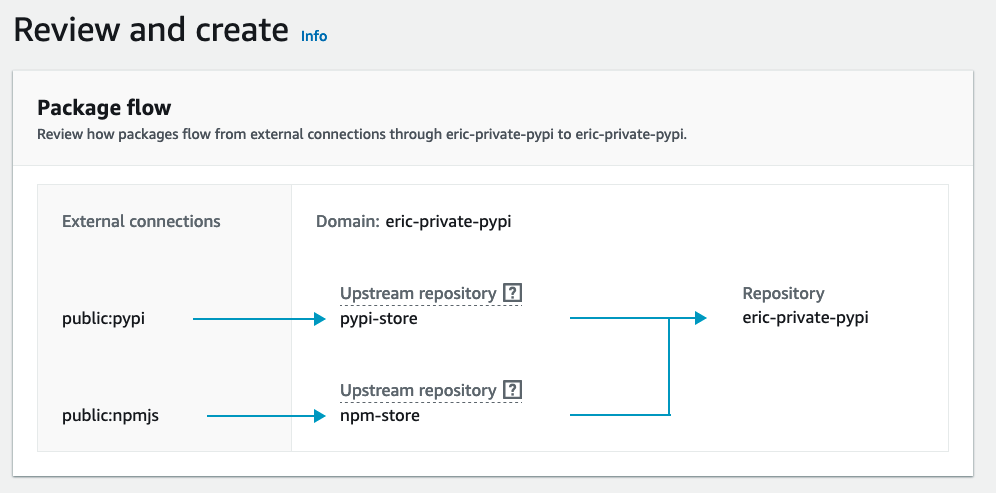
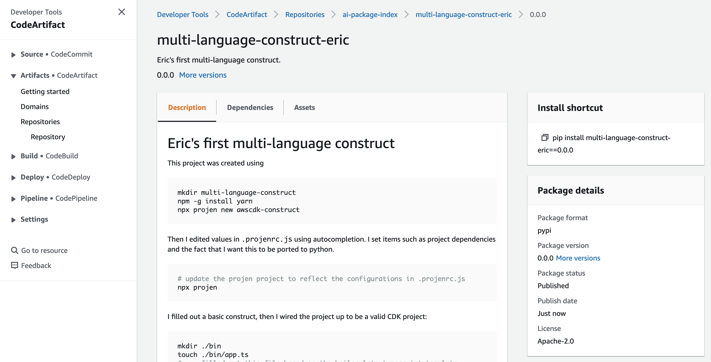

# Eric's first multi-language construct

This project was created using

```bash
mkdir multi-language-construct
npm -g install yarn
npx projen new awscdk-construct
```

Then I edited values in `.projenrc.js` using autocompletion. I set items such as project
dependencies and the fact that I want this to be ported to python.

```bash
# update the projen project to reflect the configurations in .projenrc.js
npx projen
```

I filled out a basic construct, then I wired the project up to be a valid CDK project:

```bash
mkdir ./bin
touch ./bin/app.ts
# ... filled out this file based on the boilerplate typescript template
```

Eventually I ejected:

```bash
npx projen eject
# helps some npm scripts to continue to work
yarn add projen --save-dev
```

## Pushing to private NPM and PyPI server

I created a private PyPI server here:

eric-private-pypi-785465075102.d.codeartifact.us-east-1.amazonaws.com

Hmm... actually, I named it `eric-private-pypi`, but I suspect that is a bad
name because I think both python *and* TypeScript packages will go there.



### Fail!

I learned that this project does not support pushing to CodeArtifact without
manually resetting a CodeArtifact auth token in the GitHub secrets every single day :(

They say this is on their roadmap, but it involves two projects, so it feels unlikely
to be soon. So, I ran `npx projen eject` to regain control 

## My reaction to `projen` and TypeScript

I'm pleased to see that this projen template includes:

- linting and its enforcement
- tests and enforcement that they pass
- an `npx projen build` command that 

# Insights

- `projen` seems to be extendable. They call it "Software CDK".
- `projen` enforces that certain files cannot be changed; that was genuinely awesome
  until the template fundamentally didn't support deploying to CodeArtifact;
  I think we could learn from the way `projen` approached this problem. Their
  motto is "Templates are evil" (you make 50 projects with them and things get
  out of control)
- There is an `awscdk-construct` and `cdktf-construct` template you
  can use. They both derive from a `jsii` project which has tooling
  for generating the JSII packages in different languages. This feature is
  great.
- The projen opinions are *veeeery* coupled to GitHub. 
- It must have been designed
  primarily for open-source constructs, because it doesn't currently have a good
  built-in way to publish to a private npm/PyPI/maven repo.
- by default, all files/folders end up in the typescript package (and therefore
  the python, .NET, etc. packages since the JSII gets zipped inside the latter) unless
  they are added to `.npmignore`.
- after ejecting, we `package.json` shows scripts like a Justfile/makefile that can
  be run with `npm run <subcommand>`. We only have subcommands for *publishing*
  JS and Python. That's because we only configured those two publishing options
  in the `.projenrc.js` before ejecting.
- `npx projen bump` is surprisingly important. You need to run it at least once
  for the `npm run bump` and `npm run release:trunk` commands to be available.
  The version bumps by having commit messages like: `feat: a minor bump` or
  `fix: a patch bump`. This scheme is called "conventional commits". Find the RFC
  online. I'm not sure how to do a Major bump yet...
- We can manually version bump by changing `"version"` in `package.json`

# Success! (with Python)

I've wondered for a long time if the README was visible in the AWS Console. It is!
Sadly, images don't show up there. They probably aren't making it 

